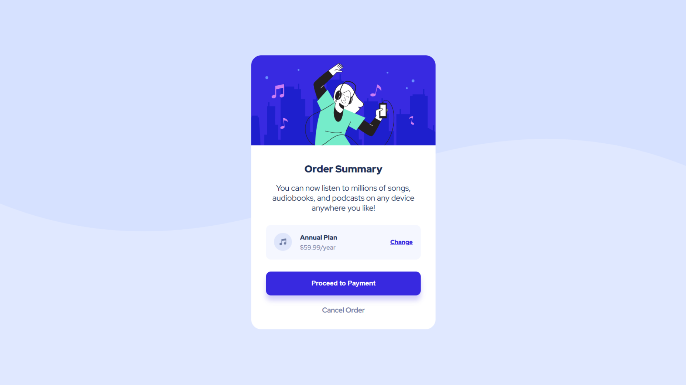

## Overview
A responsive order summary card featuring a clean pricing section, interactive buttons, and a decorative background. The layout adapts across different screen sizes while maintaining the spacing and visual hierarchy of the original design.

### Key learnings
This project gave me more practice with Flexbox, absolute positioning, and responsive layouts. I also learned how useful CSS custom properties are for keeping styles consistent and how important it is to pay attention to small details while debugging such as matching class names exactly, since CSS selectors are case-sensitive.

## Project
- Live Site URL: https://daxitaseervi.github.io/order-summary-component/

## Links
- Twitter/X: [https://x.com/kazzyyy__](https://x.com/kazzyyy__)
- Codepen: [https://codepen.io/Daxita-Seervi](https://codepen.io/Daxita-Seervi)
- Frontend Mentor: [https://www.frontendmentor.io/profile/daxitaseervi](https://www.frontendmentor.io/profile/daxitaseervi)
